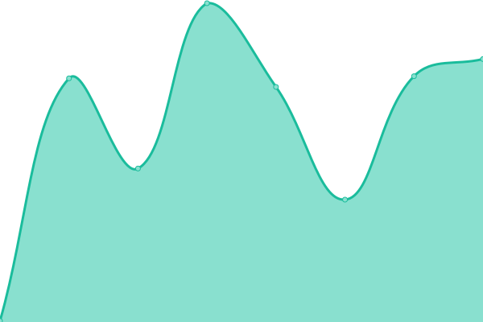
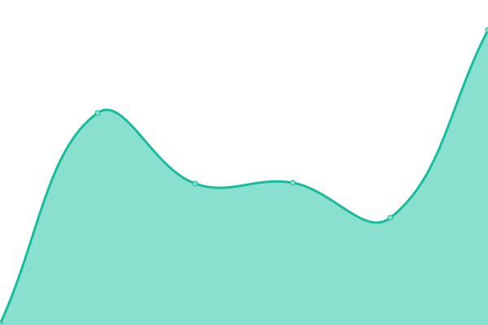
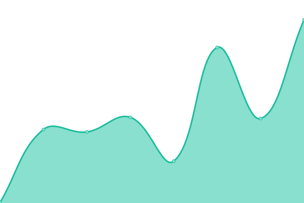

# [Kolega.dev Status](https://kolega-ai.github.io/kolega-dev-status)

This repository contains the uptime monitor and status page for [Kolega](https://kolega.dev), powered by [Upptime](https://github.com/upptime/upptime).

<!--start: status pages-->
<!-- This summary is generated by Upptime (https://github.com/upptime/upptime) -->
<!-- Do not edit this manually, your changes will be overwritten -->
<!-- prettier-ignore -->
| URL | Status | History | Response Time | Uptime |
| --- | ------ | ------- | ------------- | ------ |
|  [Website](https://kolega.dev) | 🟩 Up | [website.yml](https://github.com/kolega-ai/kolega-dev-status/commits/HEAD/history/website.yml) | 

 322ms
     
 | 

<a href="https://kolega-ai.github.io/kolega-dev-status/history/website">100.00%</a>
    

|  [App](https://app.kolega.dev) | 🟩 Up | [app.yml](https://github.com/kolega-ai/kolega-dev-status/commits/HEAD/history/app.yml) | 

 261ms
     
 | 

<a href="https://kolega-ai.github.io/kolega-dev-status/history/app">100.00%</a>
    

|  [API Health](https://api.kolega.dev/health) | 🟩 Up | [api-health.yml](https://github.com/kolega-ai/kolega-dev-status/commits/HEAD/history/api-health.yml) | 

 226ms
     
 | 

<a href="https://kolega-ai.github.io/kolega-dev-status/history/api-health">100.00%</a>
    

<!--end: status pages-->
